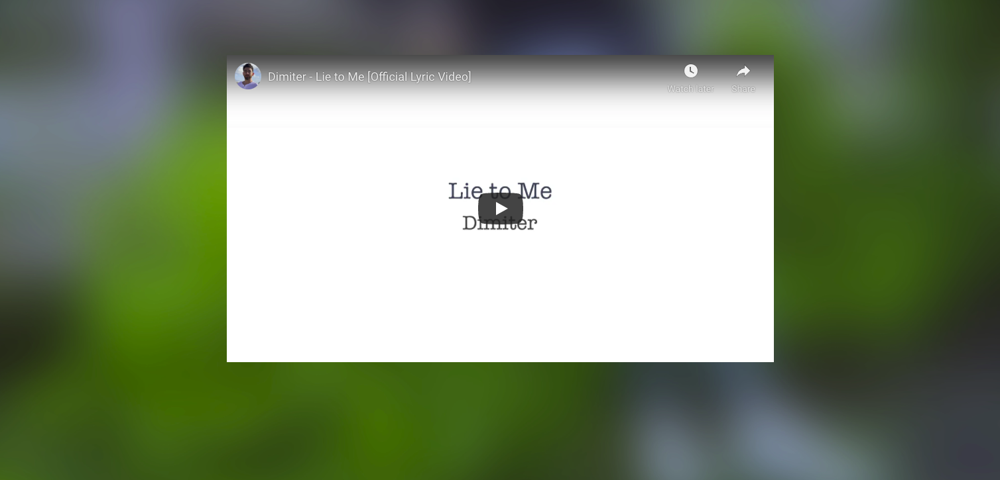
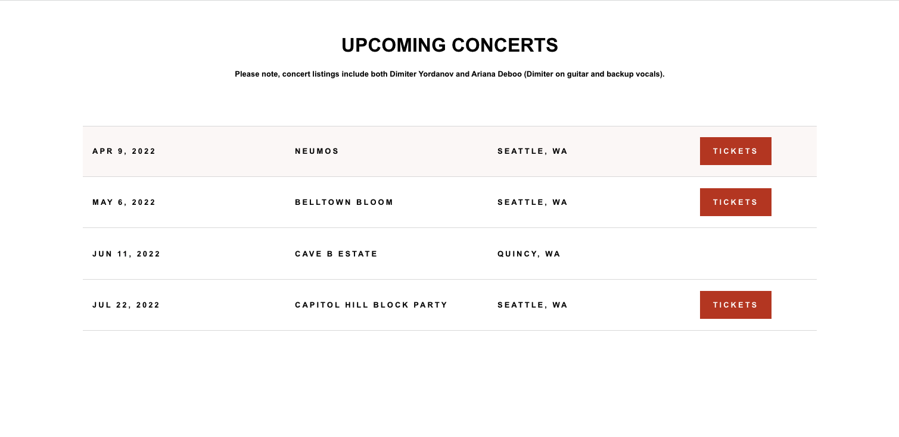
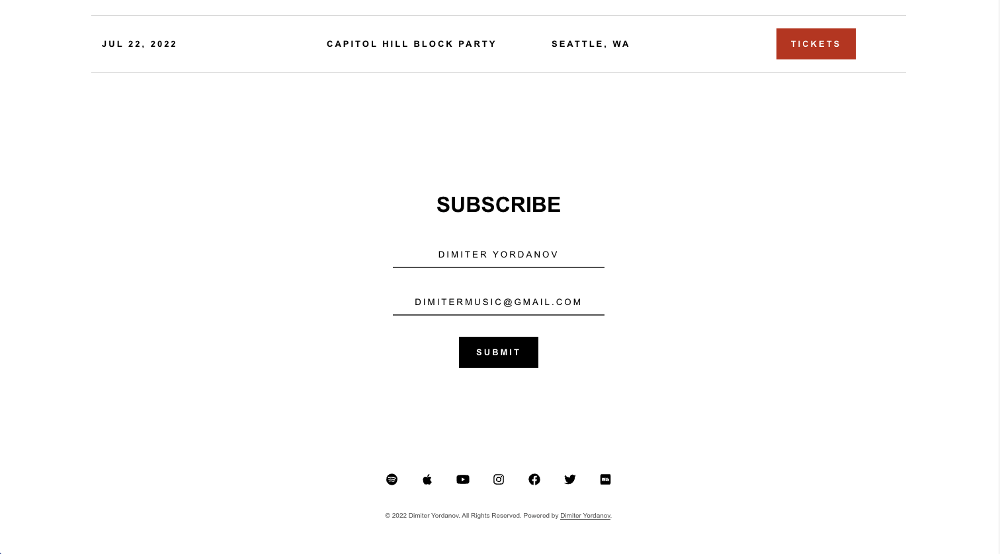

# Dimiter Yordanov | Official Site 

## Description
My official music website with social links, news, and music with dynamically rendered concerts, newsletter, and footer components.

## Table of Contents
- [Dimiter Yordanov | Official Site]
  - [Description](#description)
  - [Table of Contents](#table-of-contents)
  - [Usage](#usage)
  - [Contributing](#contributing)
  - [License](#license)
  - [Links](#links)
  - [Questions](#questions)

## Usage

Visit [dimitermusic.com](https://www.dimitermusic.com)!

New Release:  
  

Embedded, Fluid YouTube Video:  
  

Upcoming Concerts:  
  

Newsletter Signup and Footer:  
  

Custom API from which shows are fetched and conditionally rendered:  
  

JSON view of API:  
  

## Contributing
To contribute, contact me below!

## License
This application is covered under the MIT License

## Links
[Repository](https://github.com/dimitermusic/official-website)  
[Deployed Site](https://www.dimitermusic.com)

## Questions
If you have any questions, please visit my Github profile or email me using the links below

[Github](https://github.com/dimitermusic)  
[Email](mailto:info@dimitermusic.com)
